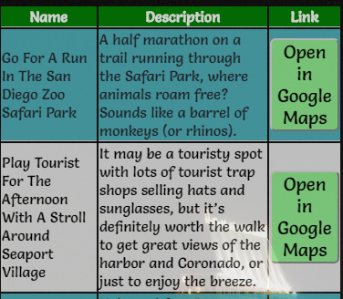

## WEB101 San Diego Top Spots
This project was a chance to learn more about manipulating the DOM by using jQuery. I used the array of objects detailing some cool spots to see in San Diego and outputted the data into a table with a link to Google Maps using string concatenation. This was a great opportunity to see how JavaScript can append HTML elements, along with learning about some neat things to do in my own city.

### App Screenshot

